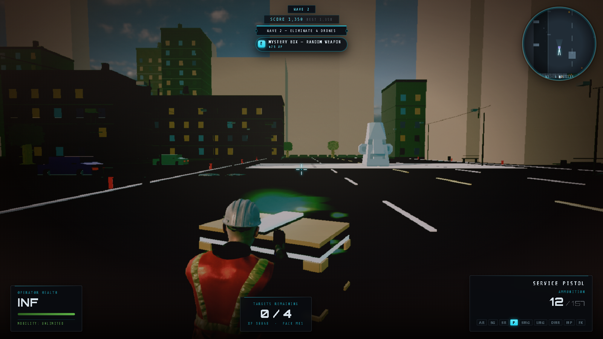
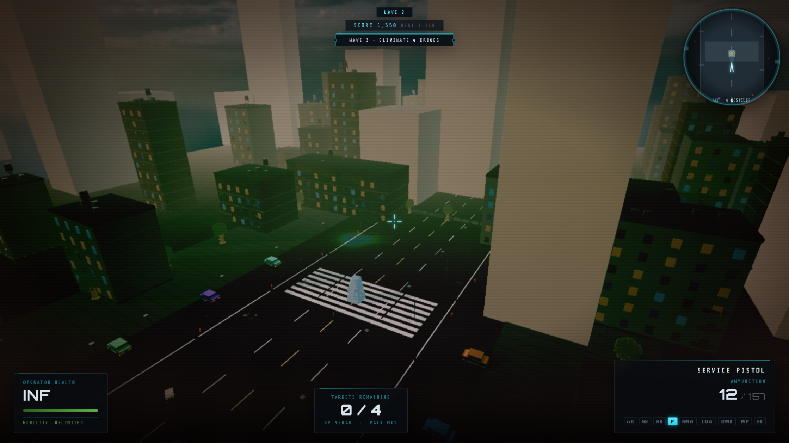
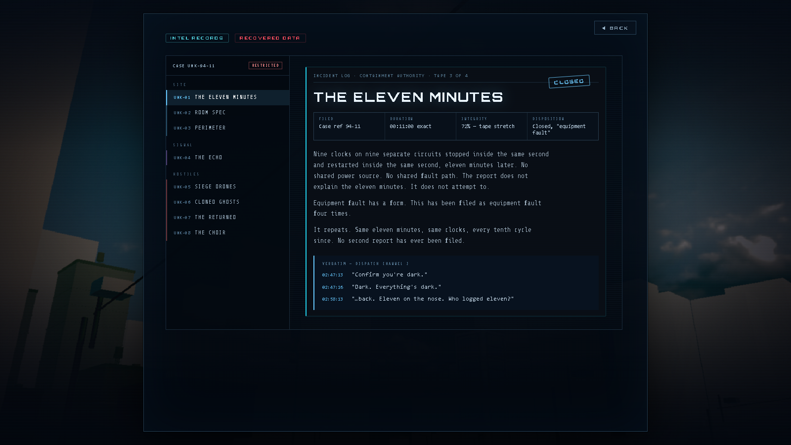
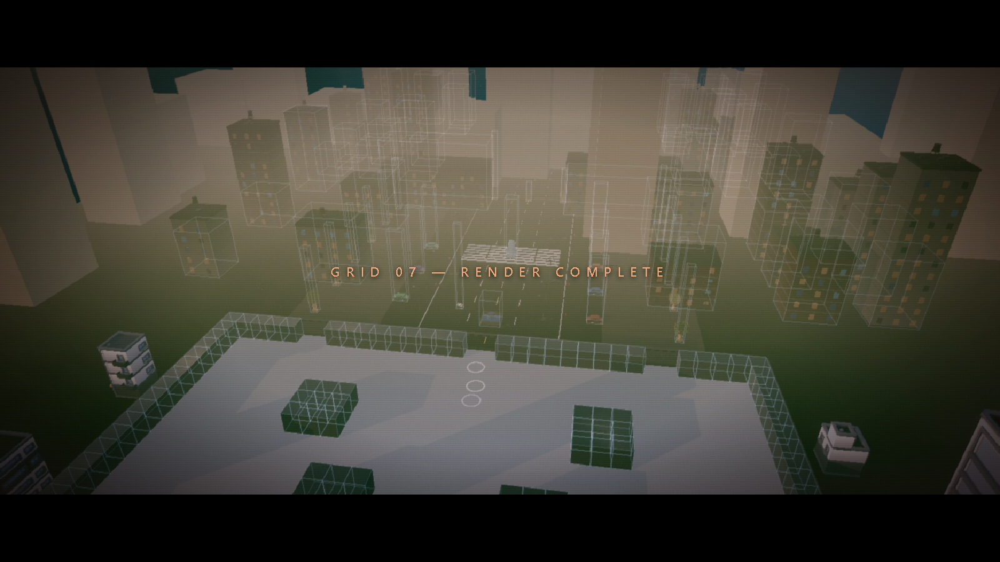
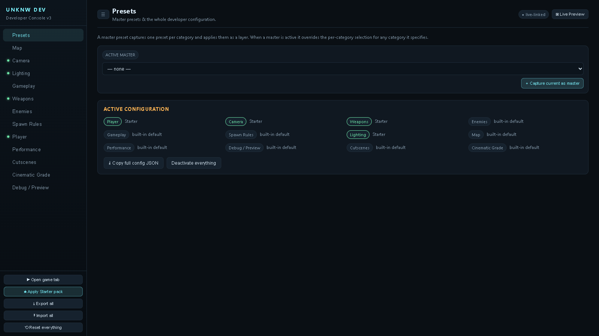
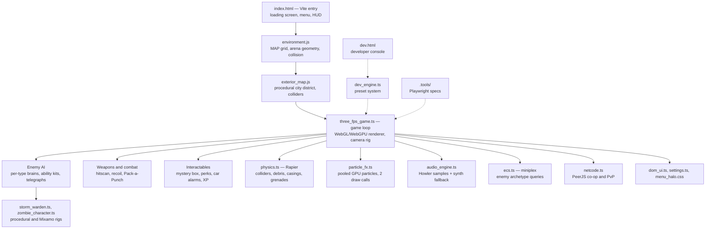

# UNKNW — Containment Protocol

A browser-based third-person wave-survival shooter built on **Three.js r166**, written in TypeScript with a Rapier physics backend. Hold an open-air urban district against escalating waves of drones, clones, zombies and storm-angels — start with nothing but a service pistol, gamble for better guns at the mystery box, stack perks at the plaza statue, and survive the wave-10 blackouts when the power dies and the sky catches fire.


## The fight

| | |
|:---:|:---:|
|  |  |
| **Siege Drones** — walking artillery on the Storm Warden rig: telegraphed lightning lances, creeping barrages and a knockback bulwark | **Null Cherub** — zone control. Sanctuary Collapse shrinks a safe ring around you; the Null Field EMP kills your sprint and reload |
|  |  |
| **The horde** — screaming, weaving zombies that swing mid-sprint on a layered upper-body attack clip | **Blackout waves** — every 10th wave the lights die, an animated fire dome replaces the sky, and everything pays double XP |

Five hostile types, each with its own AI brain rather than a shared chase routine: the **Siege Drone** phase-machine artillery, the **Blink Seraph** that phases out and re-arrives on your flank, the zone-denying **Null Cherub**, kiting **Cloned Ghost** riflemen that mirror your own movement mechanics, and the **Zombie** horde.

## The economy

| | |
|:---:|:---:|
|  |  |
| **Pack-a-Punch** — seven weapon tiers (MK1–MK7) bought with kill XP | **Mystery box** — the only source of new weapons. Roll the crate, take what it gives you |
|  |  |
| **Perk statue** — five stacking tiers: Overcharge, Vitality, Aegis, Adrenaline, Stim Module | **The district** — a procedural city grid beyond the arena, with parked cars whose alarms pull the horde off you |

## The shell

| | |
|:---:|:---:|
|  |  |
| **Menu** — a Halo: CE homage. The overlay is transparent and a second camera orbits the plaza statue behind it, so the live scene *is* the background | **Intel Records** — eight recovered documents, each a different kind of artifact: incident log, works drawing, signal intercept, personnel roster |



Starting a mission plays a directed intro cutscene — the district draws itself in as a Tron wireframe, the choir arrives, and the operator materialises into the arena. Blackout waves get their own cut.

## Quick start

```bash
npm install
npm run dev        # Vite dev server → http://localhost:3000
```

Then open `http://localhost:3000/` and hit **New Mission**. First boot takes 15–60 s (world build, enemy pools, shader warm-up); the menu unlocks only when it's genuinely ready.

```bash
npm run build      # self-contained static site in dist/
npm run typecheck  # tsc --noEmit
```

## Controls

| Input | Action |
|---|---|
| WASD / Shift / Space | Move / sprint / jump |
| Mouse / LMB / RMB | Look / fire / aim |
| R / V / G | Reload / melee / throw grenade |
| E | Interact (Pack-a-Punch, mystery box, perk statue, car alarms) |
| 1–9 | Switch weapon |
| F / I / C | Flashlight / inspect weapon / look back |
| Esc | Pause |

Nine weapons: Assault Rifle, Combat Shotgun, Precision Rifle, Service Pistol, Hornet SMG, Bastion LMG, Verdict DMR, Gemini Machine Pistol, Mauler Auto-Shotgun. You start with the pistol — the rest come out of the box.

## Features

- **Per-enemy AI brains** — a dispatcher hands each type its own brain, writing advance/lateral/retreat weights and a phase the character rig poses to. Every ability is telegraphed and dodgeable.
- **Rapier physics** — world collision runs as shape queries against a Rapier world mirrored from the map grid and the exterior footprints. Kills throw physics debris, firing ejects physics shell casings, and grenades are real rigid bodies. The movement *integrator* stays hand-written on purpose: query-based collision keeps the tuned FPS feel that a character controller would flatten.
- **XP economy** — kills fund Pack-a-Punch tiers, mystery-box rolls and five stacking perks.
- **Golden-hour HDR world** — a single HDRI drives both the visible sky and the image-based lighting, with a fixed signature colour grade over it.
- **Directed cutscenes** — an intro sequence for New Mission and a separate blackout cut, both tunable live from the developer console.
- **Pooled GPU particles** — every effect in the game (sparks, smoke, blood, debris, explosions) runs through two draw calls total, with a WebGPU fallback path.
- **Layered audio** — a Howler sample layer over a Web Audio synth fallback, mixed through real weapons/voices/world sub-buses.
- **Multiplayer** — peer-to-peer co-op and PvP FFA via PeerJS/WebRTC. Run **`Start Internet Multiplayer.bat`** (needs [cloudflared](https://github.com/cloudflare/cloudflared): `winget install Cloudflare.cloudflared`): it starts the game server plus a free Cloudflare tunnel, opens the game in Chrome, and prints one link to send your friends — no port forwarding. Heads-up: a friend's **first load pulls ~150 MB** through the tunnel, so the loading screen can take a few minutes once. For friends on mobile data or strict networks, add a free TURN relay: copy `turn-config.example.txt` → `turn-config.txt` and follow the instructions inside.
- **WebGL + WebGPU aware** — device-appropriate backend selection (desktop → WebGL, mobile → WebGPU) with automatic fallback if a session runs slow.

## Developer console



`/dev.html` is a standalone, versioned preset system — named presets per category, layered master presets, and a live preview dock. Categories cover player, camera, weapons, enemies, gameplay, spawn rules, lighting, map, cutscenes, cinematic grade, performance and debug. Changes hot-apply into a running game tab through a `storage` event; only a map rebuild or a renderer swap needs a reload. Full guide in [`DEV_MANUAL.md`](DEV_MANUAL.md).

## Architecture

Game logic is TypeScript (`three_fps_game.ts` plus `modules/*.ts`), bundled by Vite. The world builders (`environment.js`, `exterior_map.js`) remain classic scripts by design: they attach to `window` and receive `THREE` as a parameter, which keeps them loadable from both entry points without a bundler.



Two invariants are worth knowing before touching the renderer:

- **Boot readiness gate.** The HTML shell reveals the menu only once `bootGame()` has finished building the world, priming enemy pools and warming every shader (`body[data-rb-ready]`). Tests wait on that flag, never on a timer.
- **The visible-light count is a shader-cache invariant.** Three.js bakes the light count into every shader program, so a count that changes at runtime relinks every material in the scene at ~400 ms each. Lights are dimmed to zero intensity, never toggled, and pooled objects never carry their own lights.

## Testing

Playwright specs live in `.tools/` — boot stability, shader-cache invariants, physics collision parity, particles, dev console, multiplayer and perf probes:

```bash
npx playwright test
```

Loading the game with `?test=1` exposes the read-only `window.__rbTest` harness the specs drive. The README gallery above is generated by one of them:

```bash
npx playwright test .tools/readme-shots.spec.cjs --headed
```

Note that headless Chrome renders this scene at ~2.5 fps under SwiftShader, so specs poll for state rather than waiting a fixed interval — and screenshots are taken headed, on a real GPU.

## Asset credits

- HDRI skies — [Poly Haven](https://polyhaven.com) (CC0)
- City kit buildings/props — [Kenney](https://kenney.nl) (CC0)
- Landmark models — [Khronos glTF Sample Assets](https://github.com/KhronosGroup/glTF-Sample-Assets) (CC0)
- Character models & animations — [Mixamo](https://www.mixamo.com) (Adobe Mixamo license)
- SFX — [Kenney](https://kenney.nl) audio packs (CC0)
