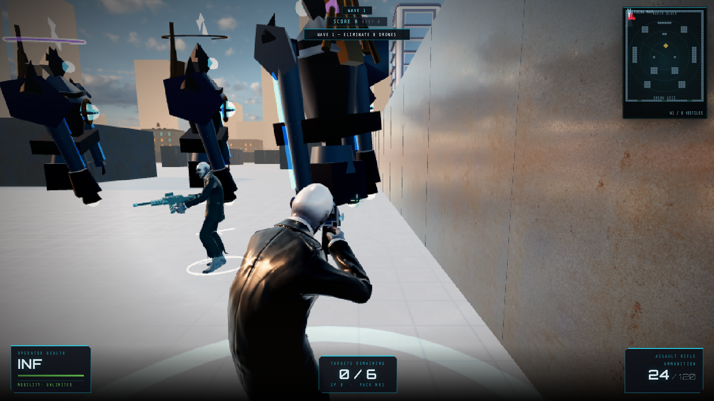
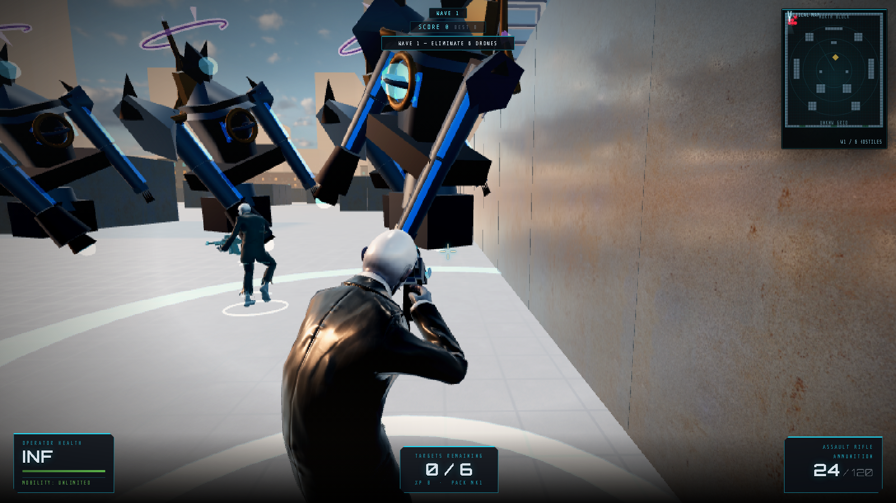
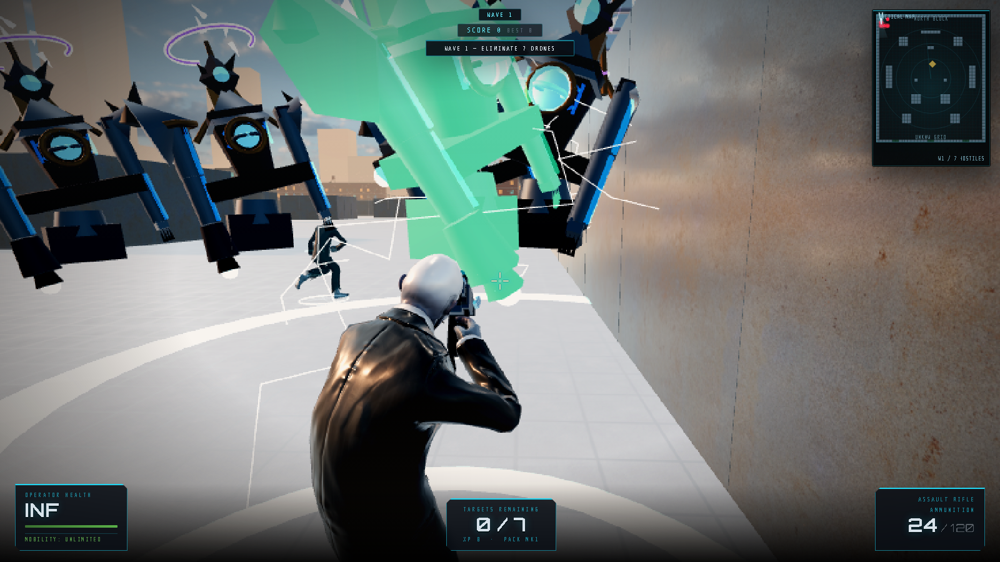
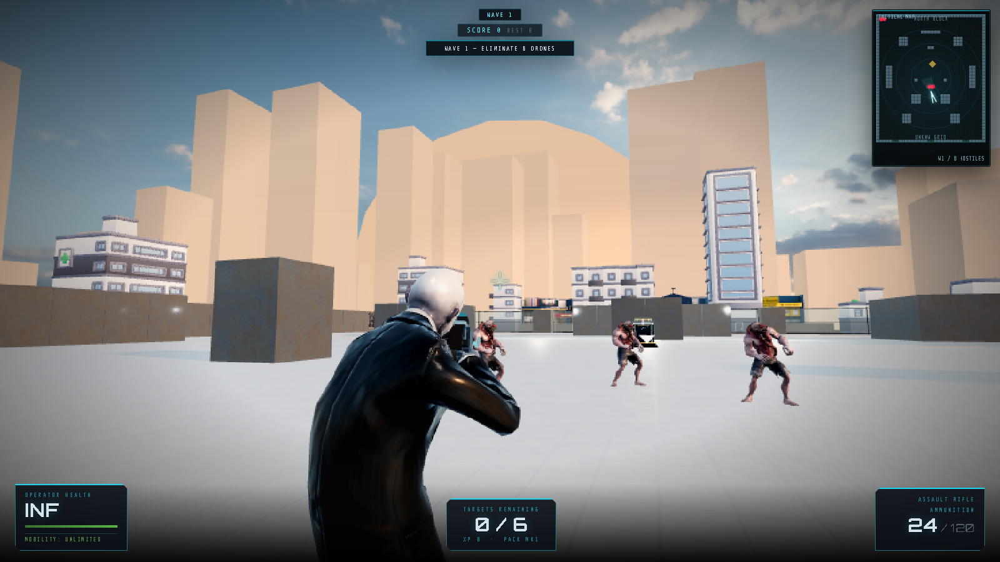
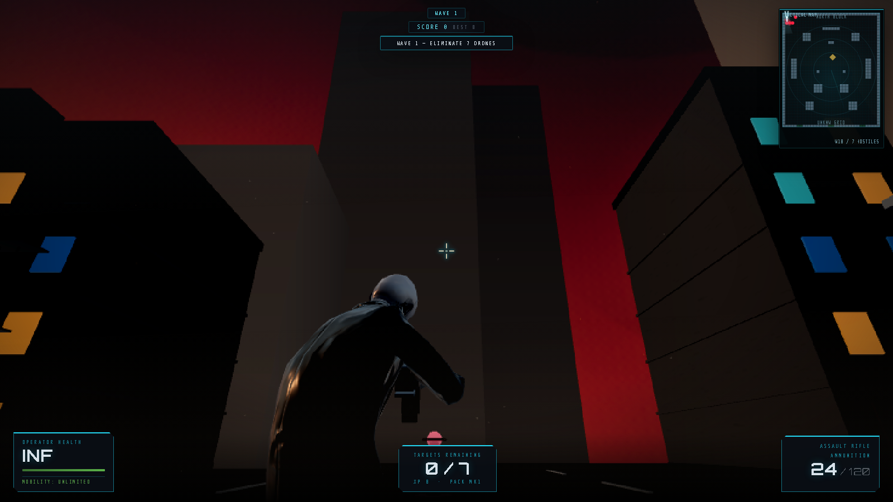
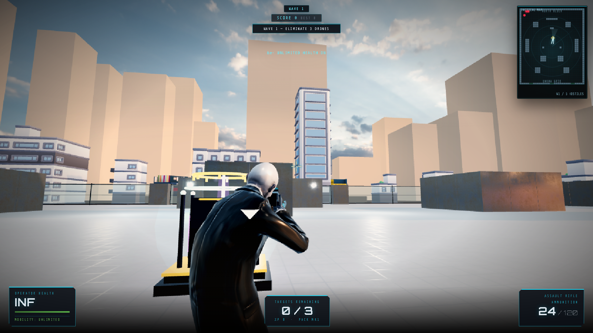
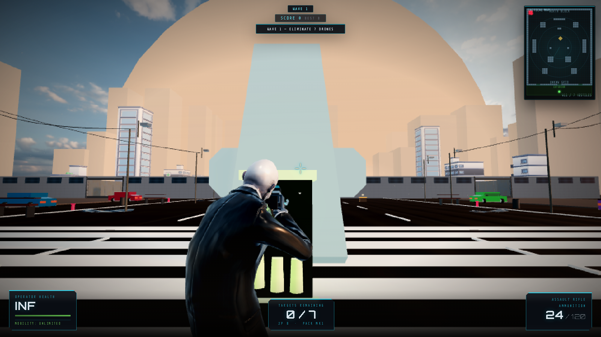
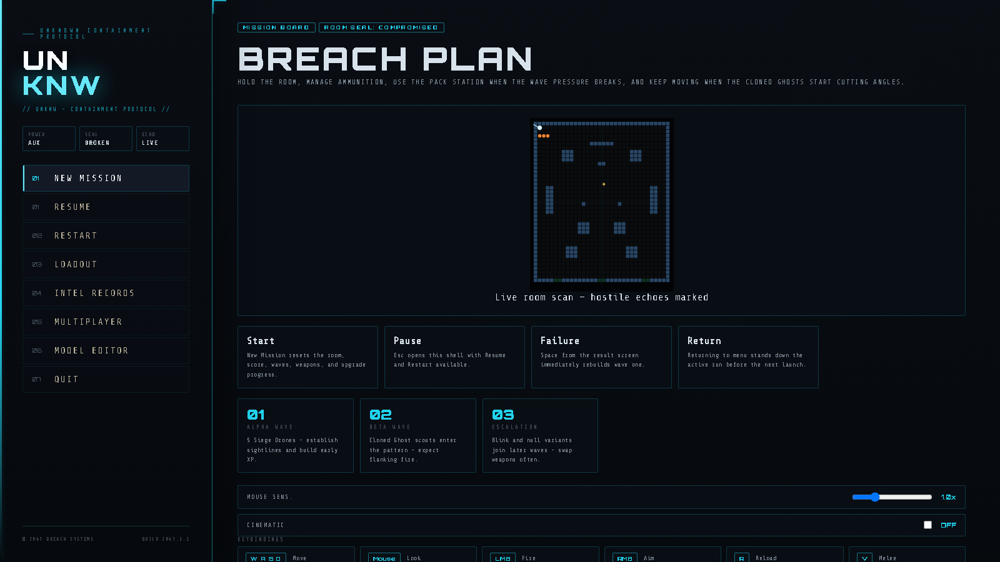
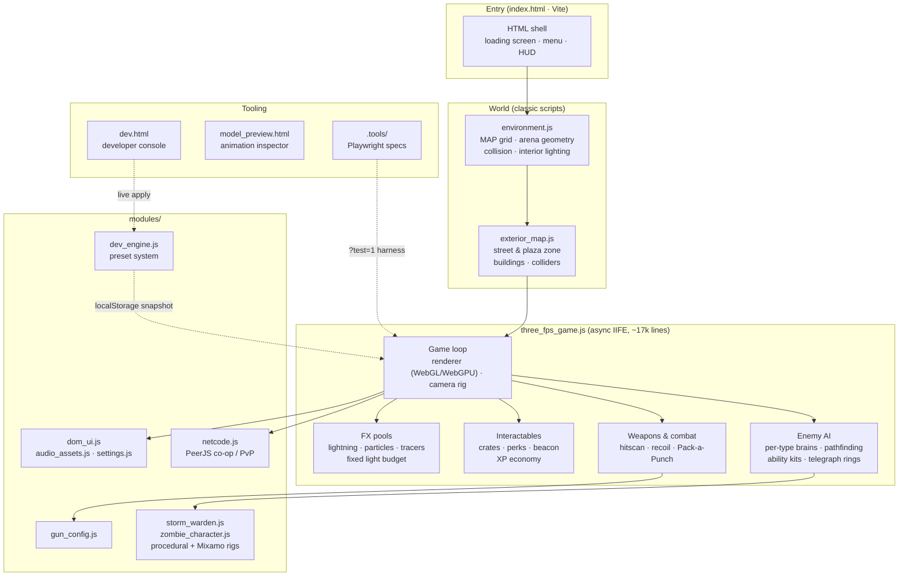

# UNKNW — Containment Protocol

A browser-based third-person wave-survival shooter built on **Three.js r166**. Hold an open-air urban arena against escalating waves of drones, clones, zombies and storm-angels — upgrade weapons at the Pack-a-Punch, buy perks in the exterior plaza, and survive the wave-10 blackouts when the sky catches fire.



## The fight

| | |
|:---:|:---:|
|  |  |
| **Storm Wardens** — walking artillery with telegraphed lightning lances and creeping barrages | **Null Cherub** — bombards everything *outside* a shrinking safe zone that drags you toward it |
|  |  |
| **The horde** — screaming, weaving zombies that swing mid-sprint | **Blackout waves** — every 10th wave the lights die and a burning sky is all that's left |

## The economy

| | |
|:---:|:---:|
|  |  |
| **Pack-a-Punch** — seven weapon tiers bought with kill XP | **Exterior plaza** — perk machine, wall-buy weapon crates and a horde beacon for bonus-XP elites |



## Quick start

```bash
npm install
npm run dev        # Vite dev server → http://localhost:3000
```

Then open `http://localhost:3000/` and hit **New Mission**. First boot takes 15–60 s (world build + shader warm-up); the menu unlocks when it's ready.

`npm run build` produces a self-contained static site in `dist/`.

## Controls

| Input | Action |
|---|---|
| WASD / Shift | Move / sprint |
| Mouse / LMB / RMB | Look / fire / aim |
| R / V / Space | Reload / melee / jump |
| E | Interact (Pack-a-Punch, wall-buys, perk machine, horde beacon) |
| 1-3 | Switch weapon |
| Esc | Pause |

## Features

- **Five enemy types with specialised AI brains** — a phase-machine artillery Warden, a flank-teleporting Blink Seraph, a zone-controlling Null Cherub, kiting clone riflemen and weaving zombie hordes, each with telegraphed, dodgeable abilities.
- **XP economy** — kills fund Pack-a-Punch weapon tiers (MK1-7), wall-buy weapon crates, a three-tier perk machine (Overcharge / Vitality / Aegis) and a horde beacon for bonus-XP elite squads.
- **Golden-hour HDR world** — a single HDRI drives the visible sky and image-based lighting; blackout waves (every 10th) cut the power and set the sky on fire.
- **Multiplayer** — peer-to-peer co-op and PvP FFA via PeerJS/WebRTC (`Start Multiplayer.bat` or the in-game Multiplayer menu). Optional TURN relay for strict-NAT peers: copy `turn-config.example.txt` → `turn-config.txt` and fill in free credentials (instructions inside).
- **Developer console** — open `/dev.html` for a live-tuning preset system covering player, weapons, enemies, lighting, map and renderer settings (see `DEV_MANUAL.md`).
- **WebGL + WebGPU aware** — device-appropriate renderer selection with automatic fallback; every effect is built from pooled geometry and a fixed light budget, so ability spam never recompiles a shader.

## Architecture



**Boot sequence:** the HTML shell reveals the menu only after `bootGame()` finishes building the world, priming enemy pools and warming every shader (`body[data-rb-ready]`). At runtime the visible-light count is treated as an invariant — lights are dimmed, never toggled — because Three.js bakes the light count into every shader program.

## Testing

Playwright specs live in `.tools/` (boot stability, shader-cache invariants, dev console, perf probes):

```bash
npx playwright test
```

Loading the game with `?test=1` exposes the read-only `window.__rbTest` harness used by the specs.

## Asset credits

- HDRI skies — [Poly Haven](https://polyhaven.com) (CC0)
- City kit buildings/props — [Kenney](https://kenney.nl) (CC0)
- Landmark models — [Khronos glTF Sample Assets](https://github.com/KhronosGroup/glTF-Sample-Assets) (CC0)
- Character models & animations — [Mixamo](https://www.mixamo.com) (Adobe Mixamo license)
- SFX — [Kenney](https://kenney.nl) audio packs (CC0)
